# [Daily Updates] Intel® Edge AI for IoT Developers


# Day 1

**SETUP**
> I think no need to setup since they provide workspace for running each exercise.
1) Install openvino toolkit.

   Configure EACH time for setting up ENV. 

   Ref: https://docs.openvinotoolkit.org/2020.3/_docs_install_guides_installing_openvino_windows.html#set-the-environment-variables 
   ```bash
   cd C:\Program Files (x86)\IntelSWTools\openvino\bin\
   setupvars.bat
   ```
2) Install DL Workbench.
    - Needs Docker. Installing docker requires virtualization.
        - Enable Hyper-V feature from Windows Features on/off.
        - Enable Virtualization Technology from bios. 
        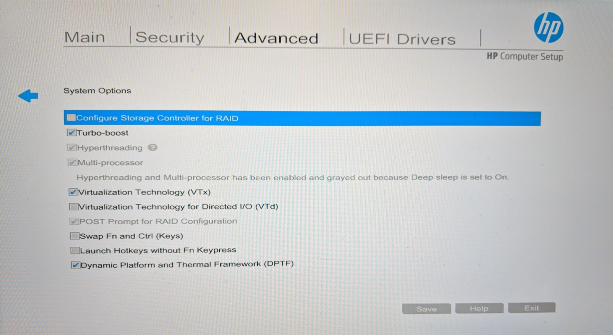
   ```
   docker pull openvino/workbench:latest  
   docker run -p 127.0.0.1:5665:5665 --name workbench -e PROXY_HOST_ADDRESS=0.0.0.0 -e PORT=5665 -it openvino/workbench:latest
   ```
   - When the command is executed, point your browser to http://127.0.0.1:5665. The DL Workbench Get Started page appears:
   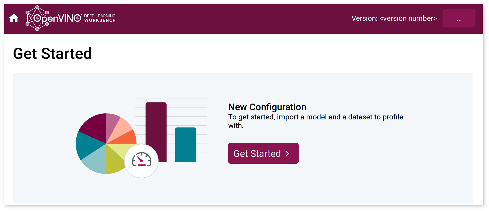
3) Install Intel's VTune Amplifier/Profiler.

## LESSON 1 - Intro to Edge AI
- History, Importance, Use of Open Model Zoo for pretrained models

## LESSON 2 - Leveraging Pre-trained Models
- OpenVINO toolkit
    - The OpenVINO™ Toolkit’s name comes from “Open Visual Inferencing and Neural Network Optimization”. It is largely focused around optimizing neural network inference, and is open source.
    - The smaller, quicker models OpenVINO™ generates, along with the hardware optimizations it provides, are great for lower resource applications. For example, an IoT device does not have the benefit of multiple GPUs and unlimited memory space to run its apps.
- CV models covered here
    - Classification, Detection, and Segmentation
    - Pose Estimation & text recognition are different (not covered here)
    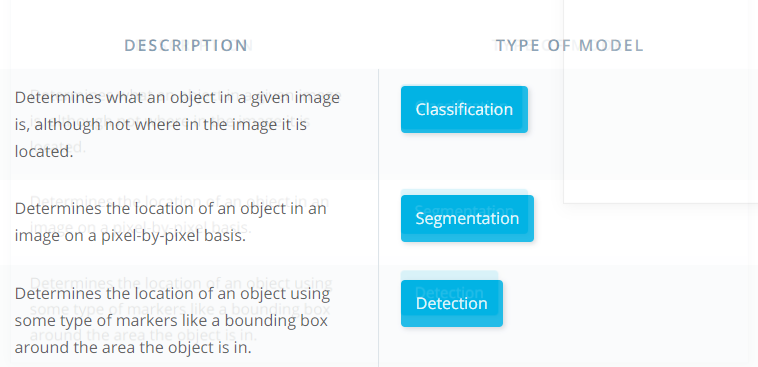
    - SSD: classification + object detection using default bounding boxes at different network layers (so need not hit multiple scales for same layer)
    - Resnet: uses residual layers to skip over sections of layers, helps convergence to occur faster (by avoiding vanishing gradient problem - also solved by normalisation of inputs to each different layer)
    - Mobilenet: 1x1 convolutions for faster inference without substantial loss in accuracy
    - Papers: 
        - [SSD](https://arxiv.org/abs/1512.02325)
        - [YOLO](https://arxiv.org/abs/1506.02640)
        - [Faster RCNN](https://arxiv.org/abs/1506.01497)
        - [MobileNet](https://arxiv.org/abs/1704.04861)
        - [ResNet](https://arxiv.org/abs/1512.03385)
        - [Inception](https://arxiv.org/pdf/1409.4842.pdf)
- Pretrained models
    - https://software.intel.com/en-us/openvino-toolkit/documentation/pretrained-models 
    - Many different models available through openvino toolkit (so far none of them use GAN). Text, pose, human, vehicle. (detection/classification/segmentation)
- Preprocessing inputs
    - RGB Vs BGR
    - Image Resizing 
    - Normalization
 
    ```
    def preprocessing(input_image, height, width):
        '''
        (h, w, 3) => (1, 3, h_resize, w_resize)
        Given an input image, height and width:
        - Resize to height and width
        - Transpose the final "channel" dimension to be first
        - Reshape the image to add a "batch" of 1 at the start 
        '''
        image = cv2.resize(input_image, (width, height)) # (h_resize, w_resize, 3)
        image = image.transpose((2,0,1)) # (3, h_resize, w_resize)
        image = image.reshape(1, 3, height, width) # (1, 3, h_resize, w_resize)
        
        return image
    ```
- Network Outputs
    - Classification => straightforward outputs (num_classes confidence)
    - Bounding boxes => varying outputs (num_boxes => each box => class + confidence + x,y info), may need to rescale box if image was resized.
    - Semantic segmentation => output is pixel by pixel
    
End of Day 1 Progress
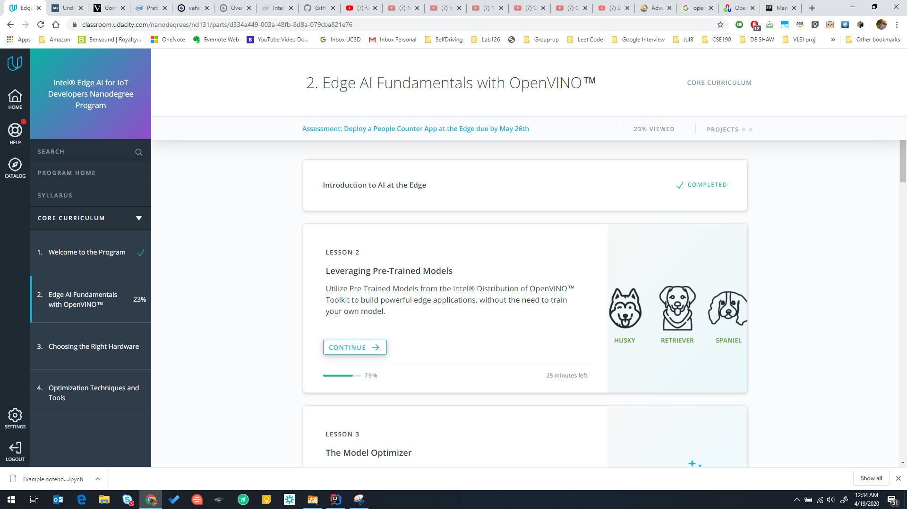

## Day 2

**LESSON 2 (cont...)**

### Exercise code

**handle_models.py**
```python
def handle_pose(output, input_shape):
    '''
    Handles the output of the Pose Estimation model.
    Returns ONLY the keypoint heatmaps, and not the Part Affinity Fields.
    '''
    # TODO 1: Extract only the second blob output (keypoint heatmaps)
    # TODO 2: Resize the heatmap back to the size of the input
    # [SAKTHI] Output is a dict, so first convert to list
    # heatmaps = output[list(output)[1]]
    heatmaps = output['Mconv7_stage2_L1'] # part affinity fields => lines connecting keypoints
    # heatmaps = output['Mconv7_stage2_L2'] # keypoint heatmaps => points

    # convert to numpy to reshape etc
    heatmaps = np.array(heatmaps)
    h = [cv2.resize(x, input_shape) for x in heatmaps[0]]

    return h


def handle_text(output, input_shape):
    '''
    Handles the output of the Text Detection model.
    Returns ONLY the text/no text classification of each pixel,
        and not the linkage between pixels and their neighbors.
    '''
    # TODO 1: Extract only the first blob output (text/no text classification)
    # TODO 2: Resize this output back to the size of the input
    textSeg = output[list(output)[0]]
    textSeg = np.array(textSeg)
    t = [cv2.resize(x, input_shape) for x in textSeg[0]]

    return t


def handle_car(output, input_shape):
    '''
    Handles the output of the Car Metadata model.
    Returns two integers: the argmax of each softmax output.
    The first is for color, and the second for type.
    '''
    # TODO 1: Get the argmax of the "color" output
    # TODO 2: Get the argmax of the "type" output
    carColor = np.argmax(output["color"])
    carType = np.argmax(output["type"])

    return [carColor, carType]
```

**app.py**
- Use of np.dstack for building mask (segmentation in pose detection)
```
def get_mask(processed_output):
    '''
    Given an input image size and processed output for a semantic mask,
    returns a masks able to be combined with the original image.
    '''
    # Create an empty array for other color channels of mask
    empty = np.zeros(processed_output.shape)
    # Stack to make a Green mask where text detected
    # [SAKTHI] New learning => dstack used for concatenating in the 3rd dimension (vstack, hstack -- for concatenating in 2 dimensions)
    mask = np.dstack((empty, processed_output, empty))

    return mask
```
### Exercise output


## LESSON 3 - The Model Optimizer

The Model Optimizer helps convert models in multiple different frameworks to an Intermediate Representation, which is used with the Inference Engine. If a model is not one of the pre-converted models in the Pre-Trained Models OpenVINO™ provides, it is a required step to move onto the Inference Engine.

As part of the process, it can perform various optimizations that can help shrink the model size and help make it faster, although this will not give the model higher inference accuracy. In fact, there will be some loss of accuracy as a result of potential changes like lower precision. However, these losses in accuracy are minimized.

**Optimization techniques**

- Quantization: reducing the precision of model (without affecting accuracy that much)
    - Models will get smaller in memory & faster
- Freezing
- Fusion: Combining different layer operations (batch morn, activation, conv) to one (reducing computational overhead & context switching)
Ref: https://docs.openvinotoolkit.org/2019_R3/_docs_MO_DG_prepare_model_Model_Optimization_Techniques.html 

**Intermediate Representation (IR)**

Intermediate Representations (IRs) are the OpenVINO™ Toolkit’s standard structure and naming for neural network architectures. A `Conv2D` layer in TensorFlow, `Convolution` layer in Caffe, or `Conv` layer in ONNX are all converted into a Convolution layer in an IR.

The IR is able to be loaded directly into the Inference Engine, and is actually made of two output files from the Model Optimizer: an XML file and a binary file. The XML file holds the model architecture and other important metadata, while the binary file holds weights and biases in a binary format.

> The Model Optimizer works almost like a translator here, making the Intermediate Representation a shared dialect of all the supported frameworks, which can be understood by the Inference Engine.

Framework to IR layer mapping: https://docs.openvinotoolkit.org/2019_R3/_docs_MO_DG_prepare_model_Supported_Frameworks_Layers.html 
IR layers Ref: https://docs.openvinotoolkit.org/2019_R3/_docs_MO_DG_prepare_model_convert_model_IRLayersCatalogSpec.html

**TF to IR**

- Using model zoo
- Unfrozen models: Use `--mean_values` & `--scale` options (recommended to freeze first -- freezing a graph is a TF specific function)
- Frozen models: Use `--tensorflow_use_custom_operations_config` (`--transformations_config` in 2020 OpenVino version) & `--tensorflow_object_detection_api_pipeline_config`
- Use `--reverse_input_channel` since Opencv uses BGR format

Ref: https://docs.openvinotoolkit.org/2019_R3/_docs_MO_DG_prepare_model_convert_model_Convert_Model_From_TensorFlow.html 
Object Det Model conversion parameters: https://docs.openvinotoolkit.org/2019_R3/_docs_MO_DG_prepare_model_convert_model_tf_specific_Convert_Object_Detection_API_Models.html 

```
python /opt/intel/openvino/deployment_tools/model_optimizer/mo.py --input_model frozen_inference_graph.pb --tensorflow_object_detection_api_pipeline_config pipeline.config --reverse_input_channels --tensorflow_use_custom_operations_config /opt/intel/openvino/deployment_tools/model_optimizer/extensions/front/tf/ssd_v2_support.json
```

**Caffe to IR**
Ref: https://docs.openvinotoolkit.org/2019_R3/_docs_MO_DG_prepare_model_convert_model_Convert_Model_From_Caffe.html
> For most Caffe models (ex. ImageNet), might have to use mean_values and scale parameters if we get porr peformance in inference

**ONNX to IR**
- No ONNX specific parameter is needed
- Pytorch to ONNX: https://michhar.github.io/convert-pytorch-onnx/ 
- Pytorch & Apple ML models can be converted in to ONNX models.

**Custom Layers**
- Not part of supported layers
- Ref: https://docs.openvinotoolkit.org/2019_R3/_docs_MO_DG_prepare_model_customize_model_optimizer_Customize_Model_Optimizer.html

 

Ref: https://docs.openvinotoolkit.org/2019_R3/_docs_MO_DG_prepare_model_convert_model_Convert_Model_From_ONNX.html

```
python /opt/intel/openvino/deployment_tools/model_optimizer/mo.py --input_model model.onnx
```

## Day 3
## Lesson 4 -  The Inference Engine
Where the Model Optimizer made some improvements to size and complexity of the models to improve memory and computation times, the Inference Engine provides hardware-based optimizations to get even further improvements from a model. This really empowers your application to run at the edge and use up as little of device resources as possible.

To load an IR into the Inference Engine, you’ll mostly work with two classes in the openvino.inference_engine library (if using Python):

`IECore`, which is the Python wrapper to work with the Inference Engine

`IENetwork`, which is what will initially hold the network and get loaded into IECore

### Exercise code
**feed_network.py**
```python
### Load the necessary libraries
import os
from openvino.inference_engine import IENetwork, IECore

def load_to_IE(model_xml):
    ### Load the Inference Engine API
    plugin = IECore()

    ### Load IR files into their related class
    model_bin = os.path.splitext(model_xml)[0] + ".bin"
    net = IENetwork(model=model_xml, weights=model_bin)

    ### Add a CPU extension, if applicable.
    plugin.add_extension(CPU_EXTENSION, "CPU")

    ### Get the supported layers of the network
    supported_layers = plugin.query_network(network=net, device_name="CPU")

    ### Check for any unsupported layers, and let the user
    ### know if anything is missing. Exit the program, if so.
    unsupported_layers = [l for l in net.layers.keys() if l not in supported_layers]
    if len(unsupported_layers) != 0:
        print("Unsupported layers found: {}".format(unsupported_layers))
        print("Check whether extensions are available to add to IECore.")
        exit(1)

    ### Load the network into the Inference Engine
    plugin.load_network(net, "CPU")

    print("IR successfully loaded into Inference Engine.")

    return
```

Run using 
`python feed_network.py -m /home/workspace/models/human-pose-estimation-0001.xml`


### Requests to IE
After you load the IENetwork into the IECore, you get back an ExecutableNetwork, which is what you will send inference requests to. There are two types of inference requests you can make: Synchronous and Asynchronous.
With an ExecutableNetwork, synchronous requests just use the infer function, while asynchronous requests begin with start_async, and then you can wait until the request is complete. 

**Exercise code**
```python
def sync_inference(exec_net, input_blob, image):
    '''
    Performs synchronous inference
    Return the result of inference
    '''
    result = exec_net.infer({input_blob: image})

    return result

def async_inference(exec_net, input_blob, image):
    '''
    Performs asynchronous inference
    Returns the `exec_net`
    '''
    exec_net.start_async(request_id=0, inputs={input_blob: image})
    while True:
        status = exec_net.requests[0].wait(-1)
        if status == 0:
            break
        else:
            time.sleep(1)
    return exec_net
```

## Lesson 5 - Deploying an Edge App

OpenCV basics: VideoCapture, resize, cvtColor, rectangle, imwrite

**Input streams**
- OPEN & READ => capture.open, while(capture.isOpened), capture.read
- CLOSE => release, cv2.destroyAllWindows, cv2.waitkey (ctrl+C etc.) 

**MQTT**

MQTT stands for MQ Telemetry Transport, where the MQ came from an old IBM product line called IBM MQ for Message Queues (although MQTT itself does not use queues). MQTT is a lightweight publish/subscribe architecture that is designed for resource-constrained devices and low-bandwidth setups. Port 1883 is reserved for use with MQTT.

There is a useful Python library for working with MQTT called paho-mqtt. Within, there is a sub-library called client, which is how you create an MQTT client that can publish or subscribe to the broker.

To do so, you’ll need to know the IP address of the broker, as well as the port for it. With those, you can connect the client, and then begin to either publish or subscribe to topics.

Publishing involves feeding in the topic name, as well as a dictionary containing a message that is dumped to JSON. Subscribing just involves feeding in the topic name to be subscribed to.

**FFMPEG**

The FFmpeg library is one way to do this. The name comes from “fast forward” MPEG, meaning it’s supposed to be a fast way of handling the MPEG video standard (among others).

In our case, we’ll use the ffserver feature of FFmpeg, which, similar to MQTT, will actually have an intermediate FFmpeg server that video frames are sent to. The final Node server that displays a webpage will actually get the video from that FFmpeg server.

There are other ways to handle streaming video as well. In Python, you can also use a flask server to do some similar things, although we’ll focus on FFmpeg here.

**Nodejs**

Node.js is an open-source environment for servers, where Javascript can be run outside of a browser. Consider a social media page, for instance - that page is going to contain different content for each different user, based on their social network. Node allows for Javascript to run outside of the browser to gather the various relevant posts for each given user, and then send those posts to the browser.

In our case, a Node server can be used to handle the data coming in from the MQTT and FFmpeg servers, and then actually render that content for a web page user interface.

## Lesson 3 - Choosing the Right hardware

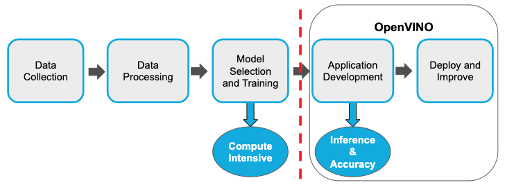

> Openvino is not used for model training, it is only used for deploying models and running inference on edge devices.

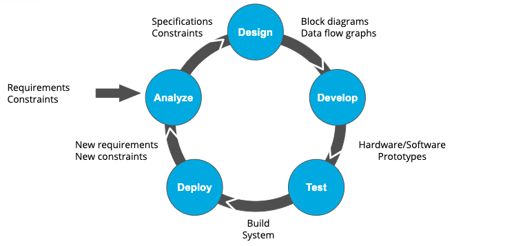

### Intel dev cloud
> The Intel DevCloud is a cloud environment that allows you to build, prototype, and check the performance of your application on several different hardware devices.

The edge nodes (CPU, GPU, VPU and FPGA or combination) can be selected using a job queue dispatch. 

> CPU, GPU, multiprocessing, multithreading

**VPU**

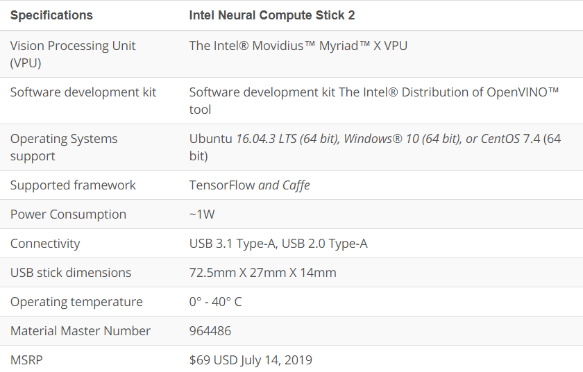
- **Neural compute engine**. The Myriad X features a neural compute engine, which is a dedicated hardware accelerator optimized for running deep learning neural networks at low power without any loss in accuracy.
- **Imaging accelerators**. As we said earlier, VPUs are specialized for image processing. One example of this specialization is found in the imaging accelerators, which have specific kernels that are used for image processing operations. These operations range from simple techniques for denoising an image, to algorithms for edge detection.
- **On-chip memory**. The Myriad X has 2.5 Mbytes of on-chip memory. This is key to minimizing off-chip data movement, which in turn reduces latency and power consumption.
- **Vector processors**. The Myriad X has sixteen proprietary vector processors known as Streaming Hybrid Architecture Vector Engine (SHAVE) processors. SHAVE processors use 128bit VLIW (Very long instruction word) architecture and are optimized for computer vision workloads.
- **Energy consumption**. The Myriad X has a very low power consumption of only 1-2 watts.

## Lesson 4 - Software Optimization techniques

**Reducing model size**
- Quantization
- Model compression 
- Knowledge distillation

**Reducing model ops**
- Model pruning (discarding of less impacting weights)
- More efficient layers (Pooling, Separable convolutions: depthwise & one point layers)

**Performance Metrics**
- FLOPs (number of operations)
- FLOPS (Ops per second)
- MACs (convolution ops => Multiply-accumulate ops, generally ~2*FLOPs)

## Projects

### Project 1 - people detector
```bash
python main.py -i resources/Pedestrian_Detect_2_1_1.mp4 -m /home/workspace/intel/person-detection-retail-0013/FP16/person-detection-retail-0013.xml -l /opt/intel/openvino/deployment_tools/inference_engine/lib/intel64/libcpu_extension_sse4.so -d CPU -pt 0.6 | ffmpeg -v warning -f rawvideo -pixel_format bgr24 -video_size 768x432 -framerate 24 -i - http://0.0.0.0:3004/fac.ffm
```

```python
client = mqtt.Client()
client.connect(MQTT_HOST, MQTT_PORT, MQTT_KEEPALIVE_INTERVAL)
client.publish("class", json.dumps({"class_names": class_names}))
client.publish("speedometer", json.dumps({"speed": speed}))
client.disconnect()
```

```python
sys.stdout.buffer.write(frame)  
sys.stdout.flush()
```

### Project 2 - queue management
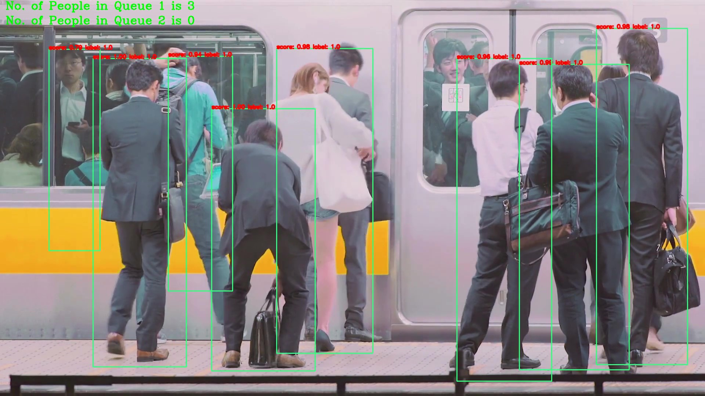
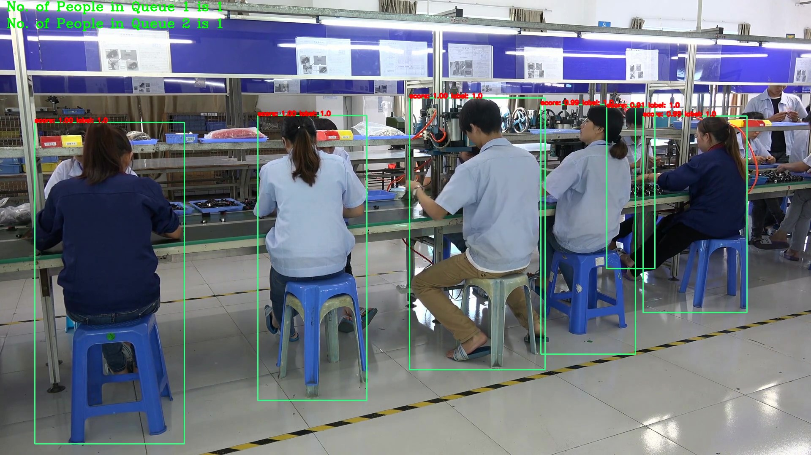
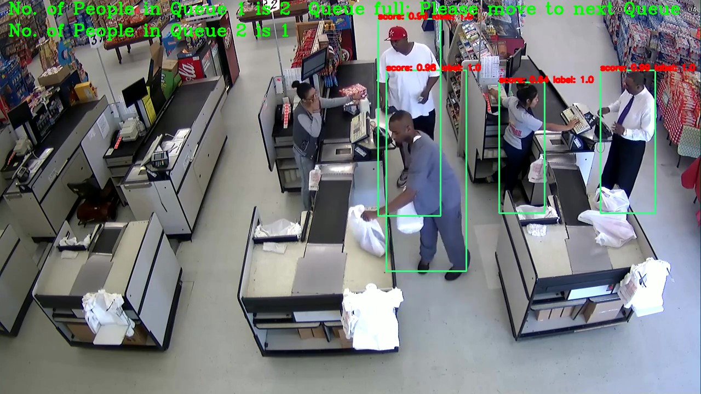


**Performance**


### Project 3 - Mouse pointer controller

```bash
python3 main.py -f model/intel/face-detection-adas-binary-0001/FP32-INT1/face-detection-adas-binary-0001.xml -fl model/intel/landmarks-regression-retail-0009/FP32/landmarks-regression-retail-0009.xml -hp model/intel/head-pose-estimation-adas-0001/FP32/head-pose-estimation-adas-0001.xml -g model/intel/gaze-estimation-adas-0002/FP32/gaze-estimation-adas-0002.xml -i demo.avi -flags fd, fld, hp, ge
```
or
```bash
python3 main.py -f model/intel/face-detection-adas-binary-0001/FP32-INT1/face-detection-adas-binary-0001.xml -fl model/intel/landmarks-regression-retail-0009/FP32/landmarks-regression-retail-0009.xml -hp model/intel/head-pose-estimation-adas-0001/FP32/head-pose-estimation-adas-0001.xml -g model/intel/gaze-estimation-adas-0002/FP32/gaze-estimation-adas-0002.xml -i cam
```

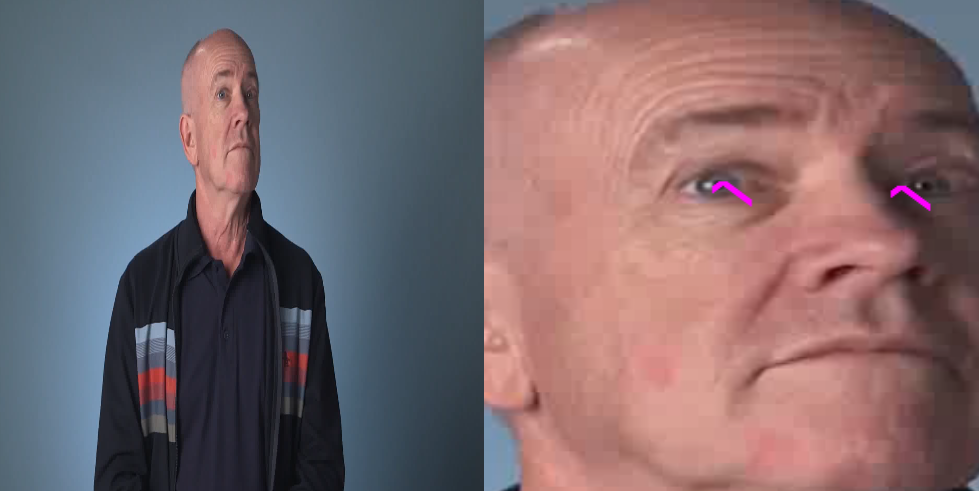


