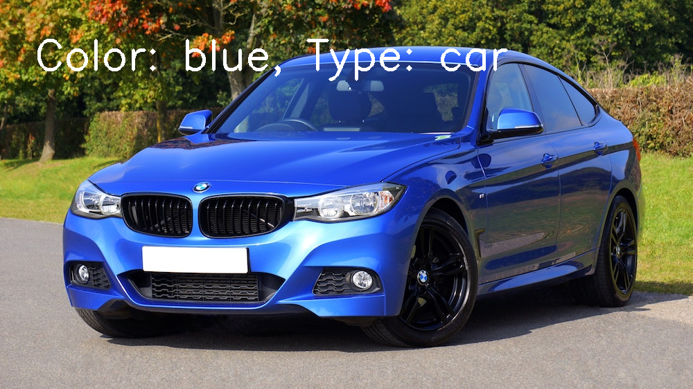

# [Daily Updates] Intel® Edge AI for IoT Developers


# Day 1

**SETUP**
> I think no need to setup since they provide workspace for running each exercise.
1) Install openvino toolkit.
2) Install DL Workbench.
    - Needs Docker. Installing docker requires virtualization.
        - Enable Hyper-V feature from Windows Features on/off.
        - Enable Virtualization Technology from bios. 
        
   ```
   docker pull openvino/workbench:latest  
   docker run -p 127.0.0.1:5665:5665 --name workbench -e PROXY_HOST_ADDRESS=0.0.0.0 -e PORT=5665 -it openvino/workbench:latest
   ```
   - When the command is executed, point your browser to http://127.0.0.1:5665. The DL Workbench Get Started page appears:
   
3) Install Intel's VTune Amplifier/Profiler.

## LESSON 1 - Intro to Edge AI
- History, Importance, Use of Open Model Zoo for pretrained models

## LESSON 2 - Leveraging Pre-trained Models
- OpenVINO toolkit
    - The OpenVINO™ Toolkit’s name comes from “Open Visual Inferencing and Neural Network Optimization”. It is largely focused around optimizing neural network inference, and is open source.
    - The smaller, quicker models OpenVINO™ generates, along with the hardware optimizations it provides, are great for lower resource applications. For example, an IoT device does not have the benefit of multiple GPUs and unlimited memory space to run its apps.
- CV models covered here
    - Classification, Detection, and Segmentation
    - Pose Estimation & text recognition are different (not covered here)
    
    - SSD: classification + object detection using default bounding boxes at different network layers (so need not hit multiple scales for same layer)
    - Resnet: uses residual layers to skip over sections of layers, helps convergence to occur faster (by avoiding vanishing gradient problem - also solved by normalisation of inputs to each different layer)
    - Mobilenet: 1x1 convolutions for faster inference without substantial loss in accuracy
    - Papers: 
        - [SSD](https://arxiv.org/abs/1512.02325)
        - [YOLO](https://arxiv.org/abs/1506.02640)
        - [Faster RCNN](https://arxiv.org/abs/1506.01497)
        - [MobileNet](https://arxiv.org/abs/1704.04861)
        - [ResNet](https://arxiv.org/abs/1512.03385)
        - [Inception](https://arxiv.org/pdf/1409.4842.pdf)
- Pretrained models
    - https://software.intel.com/en-us/openvino-toolkit/documentation/pretrained-models 
    - Many different models available through openvino toolkit (so far none of them use GAN). Text, pose, human, vehicle. (detection/classification/segmentation)
- Preprocessing inputs
    - RGB Vs BGR
    - Image Resizing 
    - Normalization
 
    ```
    def preprocessing(input_image, height, width):
        '''
        (h, w, 3) => (1, 3, h_resize, w_resize)
        Given an input image, height and width:
        - Resize to height and width
        - Transpose the final "channel" dimension to be first
        - Reshape the image to add a "batch" of 1 at the start 
        '''
        image = cv2.resize(input_image, (width, height)) # (h_resize, w_resize, 3)
        image = image.transpose((2,0,1)) # (3, h_resize, w_resize)
        image = image.reshape(1, 3, height, width) # (1, 3, h_resize, w_resize)
        
        return image
    ```
- Network Outputs
    - Classification => straightforward outputs (num_classes confidence)
    - Bounding boxes => varying outputs (num_boxes => each box => class + confidence + x,y info), may need to rescale box if image was resized.
    - Semantic segmentation => output is pixel by pixel
    
End of Day 1 Progress


## Day 2

**LESSON 2 (cont...)**

### Exercise code

**handle_models.py**
```python
def handle_pose(output, input_shape):
    '''
    Handles the output of the Pose Estimation model.
    Returns ONLY the keypoint heatmaps, and not the Part Affinity Fields.
    '''
    # TODO 1: Extract only the second blob output (keypoint heatmaps)
    # TODO 2: Resize the heatmap back to the size of the input
    # [SAKTHI] Output is a dict, so first convert to list
    # heatmaps = output[list(output)[1]]
    heatmaps = output['Mconv7_stage2_L1'] # part affinity fields => lines connecting keypoints
    # heatmaps = output['Mconv7_stage2_L2'] # keypoint heatmaps => points

    # convert to numpy to reshape etc
    heatmaps = np.array(heatmaps)
    h = [cv2.resize(x, input_shape) for x in heatmaps[0]]

    return h


def handle_text(output, input_shape):
    '''
    Handles the output of the Text Detection model.
    Returns ONLY the text/no text classification of each pixel,
        and not the linkage between pixels and their neighbors.
    '''
    # TODO 1: Extract only the first blob output (text/no text classification)
    # TODO 2: Resize this output back to the size of the input
    textSeg = output[list(output)[0]]
    textSeg = np.array(textSeg)
    t = [cv2.resize(x, input_shape) for x in textSeg[0]]

    return t


def handle_car(output, input_shape):
    '''
    Handles the output of the Car Metadata model.
    Returns two integers: the argmax of each softmax output.
    The first is for color, and the second for type.
    '''
    # TODO 1: Get the argmax of the "color" output
    # TODO 2: Get the argmax of the "type" output
    carColor = np.argmax(output["color"])
    carType = np.argmax(output["type"])

    return [carColor, carType]
```

**app.py**
- Use of np.dstack for building mask (segmentation in pose detection)
```
def get_mask(processed_output):
    '''
    Given an input image size and processed output for a semantic mask,
    returns a masks able to be combined with the original image.
    '''
    # Create an empty array for other color channels of mask
    empty = np.zeros(processed_output.shape)
    # Stack to make a Green mask where text detected
    # [SAKTHI] New learning => dstack used for concatenating in the 3rd dimension (vstack, hstack -- for concatenating in 2 dimensions)
    mask = np.dstack((empty, processed_output, empty))

    return mask
```
### Exercise output




## LESSON 3 - The Model Optimizer

The Model Optimizer helps convert models in multiple different frameworks to an Intermediate Representation, which is used with the Inference Engine. If a model is not one of the pre-converted models in the Pre-Trained Models OpenVINO™ provides, it is a required step to move onto the Inference Engine.

As part of the process, it can perform various optimizations that can help shrink the model size and help make it faster, although this will not give the model higher inference accuracy. In fact, there will be some loss of accuracy as a result of potential changes like lower precision. However, these losses in accuracy are minimized.

**Optimization techniques**

- Quantization: reducing the precision of model (without affecting accuracy that much)
    - Models will get smaller in memory & faster
- Freezing
- Fusion: Combining different layer operations (batch morn, activation, conv) to one (reducing computational overhead & context switching)
Ref: https://docs.openvinotoolkit.org/2019_R3/_docs_MO_DG_prepare_model_Model_Optimization_Techniques.html 

**Intermediate Representation (IR)**

Intermediate Representations (IRs) are the OpenVINO™ Toolkit’s standard structure and naming for neural network architectures. A `Conv2D` layer in TensorFlow, `Convolution` layer in Caffe, or `Conv` layer in ONNX are all converted into a Convolution layer in an IR.

The IR is able to be loaded directly into the Inference Engine, and is actually made of two output files from the Model Optimizer: an XML file and a binary file. The XML file holds the model architecture and other important metadata, while the binary file holds weights and biases in a binary format.

> The Model Optimizer works almost like a translator here, making the Intermediate Representation a shared dialect of all the supported frameworks, which can be understood by the Inference Engine.

Framework to IR layer mapping: https://docs.openvinotoolkit.org/2019_R3/_docs_MO_DG_prepare_model_Supported_Frameworks_Layers.html 
IR layers Ref: https://docs.openvinotoolkit.org/2019_R3/_docs_MO_DG_prepare_model_convert_model_IRLayersCatalogSpec.html

**TF to IR**

- Using model zoo
- Unfrozen models: Use `--mean_values` & `--scale` options (recommended to freeze first -- freezing a graph is a TF specific function)
- Frozen models: Use `--tensorflow_use_custom_operations_config` (`--transformations_config` in 2020 OpenVino version) & `--tensorflow_object_detection_api_pipeline_config`
- Use `--reverse_input_channel` since Opencv uses BGR format

Ref: https://docs.openvinotoolkit.org/2019_R3/_docs_MO_DG_prepare_model_convert_model_Convert_Model_From_TensorFlow.html 
Object Det Model conversion parameters: https://docs.openvinotoolkit.org/2019_R3/_docs_MO_DG_prepare_model_convert_model_tf_specific_Convert_Object_Detection_API_Models.html 

```
python /opt/intel/openvino/deployment_tools/model_optimizer/mo.py --input_model frozen_inference_graph.pb --tensorflow_object_detection_api_pipeline_config pipeline.config --reverse_input_channels --tensorflow_use_custom_operations_config /opt/intel/openvino/deployment_tools/model_optimizer/extensions/front/tf/ssd_v2_support.json
```

**Caffe to IR**
Ref: https://docs.openvinotoolkit.org/2019_R3/_docs_MO_DG_prepare_model_convert_model_Convert_Model_From_Caffe.html
> For most Caffe models (ex. ImageNet), might have to use mean_values and scale parameters if we get porr peformance in inference

**ONNX to IR**
- No ONNX specific parameter is needed
- Pytorch to ONNX: https://michhar.github.io/convert-pytorch-onnx/ 
- Pytorch & Apple ML models can be converted in to ONNX models.

**Custom Layers**
- Not part of supported layers
- Ref: https://docs.openvinotoolkit.org/2019_R3/_docs_MO_DG_prepare_model_customize_model_optimizer_Customize_Model_Optimizer.html

 

Ref: https://docs.openvinotoolkit.org/2019_R3/_docs_MO_DG_prepare_model_convert_model_Convert_Model_From_ONNX.html

```
python /opt/intel/openvino/deployment_tools/model_optimizer/mo.py --input_model model.onnx
```

## Day 3
## Lesson 4 -  The Inference Engine

